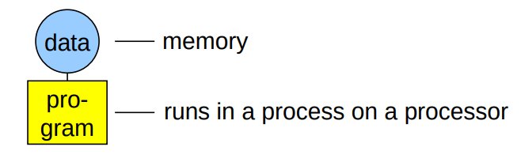
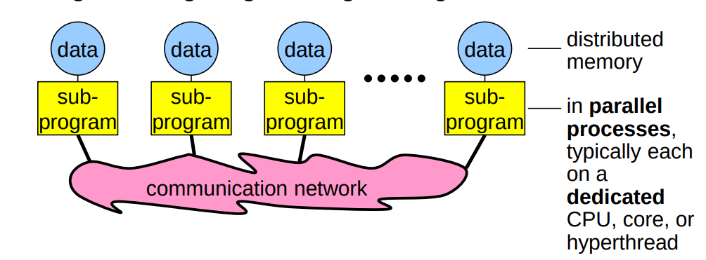
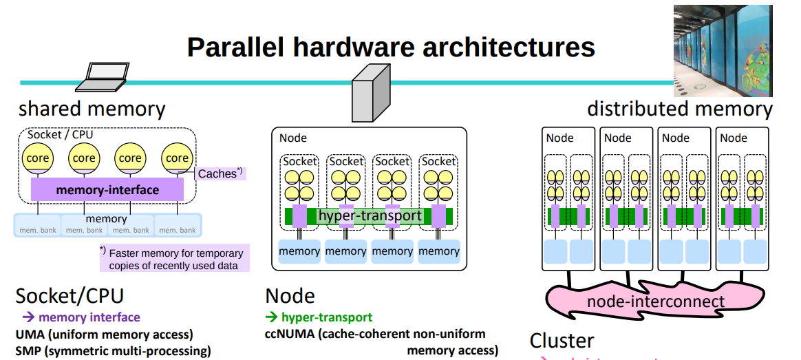

#+title: Message Passing Interface

* Message Passing

- message passing is type of communication between two or more processes or objects
  - in this model, the communicating entities can send/receive messages containing signals, functions, complex data structures, or data packets (to/from) each other

*message invokes behavior or run a program*
- different from method calling
  - it is based on the object model
    - which separates the general functional need from the specific implementation
- the program that needs the functionality calls an object and that object runs the program

*communication can happen between different applications' objects, threads, processes running on the same node or different processes running on different nodes*
/INTER-PROCESS COMMUNICATION/

*MP can be used as a more process-oriented to synchronization than the data-oriented approach used in providing mutual exclusion for shared resources*
- used in _parallel programming_ on parallel computer architectures and connection through networks

  /paradigm not affected by diff architectures it works on or the size and speed of its connecting networks/ *Virtualization*

_MP has 2 main dimensions_

1. synchronous vs. asynchronous
2. symmetric vs. asymmetric

** MPIF

_goals_
- design portable API with parallel processing computer architectures
  - and reflect the needs of programmres
- semantics of interface is language independent
- credible parallel computing
- provide virtual computing model
  - that hides architecture differences
  - and allows execution on hetergeneous systems
    - e.g. MPI impl will automatically do any necessary data conversion
      - and utilize the correct communications protocol
- make efficient MPI implementations possible
  - without significant changes in the underlying communication and system software
- scalability
  - e.g. app can create subgroups of processes
    - that allow collectivee communication operations to limit their scope to the processes involved
- relieve the programmer of coping with communication failures

1. models of communication
  A. point-to-point
     - one system passing message directly to another
  B. collective
     - one system passing message to a group

1. typing of the message contents using *tags*
   - necessary for heterogeneous support
2. *process groups/communicators*, the world where processes live in
   - and are aware of each other
3. *intracommunicator*
4. *intercommunicator*

_various MPI impls_
- MPICH, Open MPI, Microsoft MPI

*libraries are called bindings which extend MPI support to other languages by wrapping an existing MPI implementation*

e.g. `mpi4py` provides binding of MPI standard for Python
- constructed on top of MPI-1/2/3 specifications
- provides OO interfaces resembling MPI-2 C++ bindings
- supports p2p, collective communications for Python object
  - exposing the single-segment buffer interface (standard offered by python)

** Communicator
An MPI communicator specifies the communication context for a communication operation

/it specifies the set of processes which share the context, and assigns each process a unique rank taking an integer value in `0:n-1`, where `n` is the number of processes in the communicator/

*** Point-to-point Communication

- to send a message from a process to another
  - we use the communicator send function

- send takes the buffer name and the message destination

*** Collective Communication

** Synchronous

** Asynchronous

** Symmetric

** Asymmetric

* MPI.jl
 basic Julia wrapper for the portable message passing system Message Passing Interface (MPI).

 /Inspiration is taken from mpi4py, although we generally follow the C and not the C++ MPI API/
* mpi4py

MPI for Python provides MPI bindings for the Python programming language, allowing any Python program to exploit multiple processors.

/This package build on the MPI specification and provides an object oriented interface which closely follows MPI-2 C++ bindings/

** Point-to-point commnunication

  #+begin_src python
import numpy
from mpi4py import MPI
comm = MPI.COMM_WORLD
rank = comm.Get_Rank()
randNum = numpy.zeroes(1)

if rank == 1:
    randNum = numpy.random.random_sample(1)
    comm.Send(randNum, dest=0)
if rank == 0:
    comm.Recv(randNum, source=1)
  #+end_src

  *deadlock* - process will never get touched
  - and will wait indefinitely

  - _Comm.Send(buf, dest=0, tag=0)_
    - tag extra identification for the message

/MPI_Send has two behaviors and not dependent on the MPI implementation/
- MPI will not work the same way on two different systems

*Send in MPI4PY does not block waiting for a confirmation from its paired=up `Recv` to happen*

  - _Comm.Recv(buf, source=0, tag=0, status=None)_
    - Status is a structure that holds information about recieve process
      - to retrieve after the receive is done
        - the rank of the sender
        - the tag of the message
        - the length of the message

*** Message Matching

- there are a few conditions for message send with `Sent` to be receieved
  - `recv_comm`

*** Recv Wildcards

`source=MPI.ANY_SOURCE`

- allow you to handle situations where mutliple messages can be received from any source

*** Non-blocking communication

`req = comm.Isend(randNum, dest=0)`
`req.Wait()`
 - ask it to wait for request
`comm.Irecv(randNum, source=1)`
`while not req.Test():`
`req.cancel()`
 - break and cancel the request

** Collective communication

- MPI allows processes to group communication

- collective communications has its own blocking and non blocking functions

*Synchronization*
- processes wait til all the members of the communicator rea

* MPI Course by Rolf Rabenseifner

(for MPI-2.1, MPI-2.2, MPI-3.0, MPI-4.0,4.1, and MPI-5.0)

** MPI overview
- one program on several processors
- work and data distribution
- the communication network

*sequential programming paradigm*

*message-passing programming paradigm*

*** Analogy: eletric installations in parallel

- MPI subprogram = work of one electrician on one floor
- MPI process on a dedicated hardware = the electrician
- data = the electric installation
- MPI communication = real communication to guarantee that the wires are coming at the same position through the floor

*** Parallel hardware architectures

**** shared memory programming with OpenMP

*Socket/CPU*
- memory interface
/uniform memory access (UMA)/
/symmetric multi-processing (SMP)/

- all cores connected to all memory banks with same speed

/parallel execution streams on each core/
- e.g.
  $x[ 0 ... 999] = ...$ on 1st core
  $x[ 1000 ... 1999] = ...$ on 2nd core
  $x[ 2000 ... 2999] = ...$ on 3rd core

*Node*
- hyper-transport
  /ccNUMA (cache-coherent non-uniform memory access)/
- shared memory programming is possible!
$CPUs \times memory bandwidth$

- performance problems
  - each parallel execution stream should mainly access the memory of its CPU
- first touch strategy is needed to minimize remote memory access
- threads should be pinned to the physical sockets

**** distributed memory (MPI works everywhere)

*Cluster*
- node-interconnect
  /NUMA (non-uniform memory access)/
  - fast access only on its own memory!

- many programming options
  - shared mem / symmetric multi-processing inside of each node
  - distributed memory parallelization on the node interconnect
  - or simply one MPI process on each core

*** Message-passing programming paradigm

- each processor in a message passing program runs a sub-program
  - written in a conventional sequential language
    - e.g. C, fortran, Python
  - typically the same on each processor (SPMD)
  - the variables of each subprogram have
    - same name
    - different locations (distributed mem) and different data
    - i.e. all variables are private
  - communicate via special send and receive routines

/Caution! completely different model compared to/
- OpenMP
- Python with concurrent futures
- pthreads, shmem

*** Data and work distribution

- the value of `myrank` is returned by special library routine
- the system of `size` processes is started by special MPI initialization program (`mpirun` or `mpiexec`)
- all distributions decisions are based on `myrank`
- i.e. which process works on which data

*** SPMD

- single program multiple data
  - same subprogram runs on each processor

- mpi allows MPMD
  - but some vendors may be restricted to SPMD
  - MPMD can be emulated with SPMD

**** Emulation of MPMD

#+begin_src C
main(int argc, char **argv)
    {
        if(myrank < .../*process should run the ocean model*/)
        {
            ocean(/*arguments*/);
        } else {
            weather(/*arguments*/);
        }
    }
#+end_src

#+begin_src fortran
PROGRAM
IF (myrank < ...) THEN !! process should run the ocean model
      CALL ocean( some arguments )
ELSE
      CALL weather (some arguments )
ENDIF
END
#+end_src

#+begin_src python
if (myrank < ...): # process should run the ocean model
    ocean(...)
else:
    weather(...)

#+end_src

#+begin_src julia
if myrank < ...
    ocean(...)
else
    weather(...)
end
#+end_src

** Process model and language bindings

** Messages and point-to-point communication

** Nonblocking communication

** Fortran module mpi_f08

** Collective communication

** Error handling

** Groups & Communicators, Environment Management

** Virutal topologies

** One-sided communication

** Shared memory One-sided communication

** Derived datatypes

** Parallel File I/O

** MPI and Threads

** Probe, Persistent Requests, Cancel

** Process Creation and Management

** Miscellaneous MPI

** Parallelization, Performance, and Pitfalls

** Heat example

** Summary
