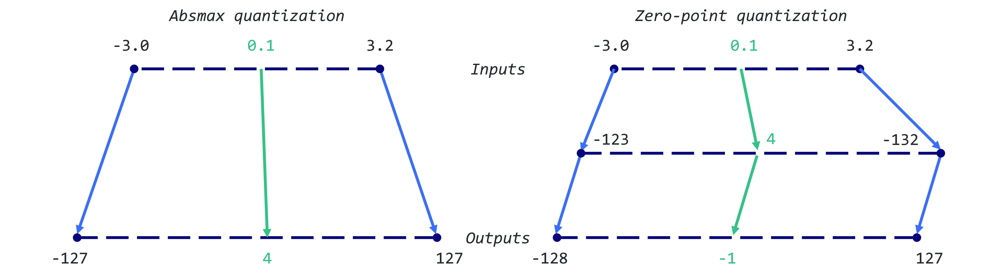

#+title: Weight Quantization

* WEIGHT QUANTIZATION

typically a size of a model is calculated by mutliplying:
- the number of parameters
  - by the precision of these values

/to save memory, weights can be stored using lower-precision data through quantization/

** Post-Training Quantization PTQ
- The weights of an already trained model are converted to a lower precision
  - without necessitating any retraining
/potential performance degradation/

** Quantization-Aware Training QAT
- the weight conversion process during the pre-training or fine-tuning stage
  - results in enhanced model performance
/computationally expensive and needs representative training data/

** Floating Point Representation background

- balancing precision and computational performance

- typically a floating point number uses $n$ bits to store a numerical value
  - $n$ bits are further partitioned into 3 distinct components
    1. *sign*
       - indicates postive or negative nature of the number
         - using one bit
    2. *exponent*
       - a segment of bits that represents the power to which the base is raised
         - can also be positive/negative allowing the number to represent very small/large values
    3. *significand/mantissa*
       - remaining bits are used to represent the significant digits of the number
         - the precision of the number heavily depends on the length of the significand

           _formula_
           $(-1)^{sign}\times base^{exponent} \times significand$

_common datatypes_
- FP32 -> 32 bits
  - 1 sign bit, eight for exponent, and remaining 23 for significand
    - high precision and high computational footprint

- FP16 -> 16 bits
  - 1 sign bit, 5 for the exponent, 10 for the significand
    - computation efficient and potential numeric stability
- BF16 -> 16 bits
  - 1 sign bit, 8 for the exponent, 7 for the significand
    - expands representable range
      - often useful compromise in deep learning

** Naive 8-bit Quantization

the goal is to map an FP32 tensor $\mathcal{X}$ (original weights)
- to an INT8 tensor $\mathcal{X}_{quant}$ (quantized weights)

*** absmax quantization
the original number is divided by *absolute maximum value of the tensor*
- and multiplied by a scaling factor (127) to map inputs into the range [-127,127]
  - to retrieve the original FP16 values,
    - the INT8 number is divided by the quantization factor
      - acknowledging some loss of precision due to rounding

        $X_{quant} = round(\frac{127}{max|X|}\cdot X)$

        $X_{dequant} = \frac{max|X|}{127} \cdot X_{quant}$

        #+begin_src python
import torch

def absmax_quantize(X):
    # Calculate scale
    scale = 127 / torch.max(torch.abs(X))

    # Quantize
    X_quant = (scale * X).round()

    # Dequantize
    X_dequant = X_quant / scale

    return X_quant.to(torch.int8), X_dequant
        #+end_src

*** zero-point quantization
we can consider asymmetric input distributions
- which is useful when you consider the output of a ReLU function (only positive)

the input values are first scaled by the total range of values (255)
- divided by the difference between the maximum and minimum values

this distribution is then shifted by the *zero-point*
- to map it into the range [-128, 127]

1. first we calculate the scale factor and zero point value

   $scale = \frac{255}{max(X)-min(X)}$
   $zeropoint = -round(scale \cdot min(X)) - 128$

2. then we can use these variables to quantize or dequantize our weights

   $X_{quant} = round(scale \cdot X + zeropoint)$
   $X_{dequant} = \frac{X_{quant}-zeropoint}{scale}$

   #+begin_src python
def zeropoint_quantize(X):
    # Calculate value range (denominator)
    x_range = torch.max(X) - torch.min(X)
    x_range = 1 if x_range == 0 else x_range

    # Calculate scale
    scale = 255 / x_range

    # Shift by zero-point
    zeropoint = (-scale * torch.min(X) - 128).round()

    # Scale and round the inputs
    X_quant = torch.clip((X * scale + zeropoint).round(), -128, 127)

    # Dequantize
    X_dequant = (X_quant - zeropoint) / scale

    return X_quant.to(torch.int8), X_dequant
   #+end_src

** 8-bit Quantization with LLM.int8()
