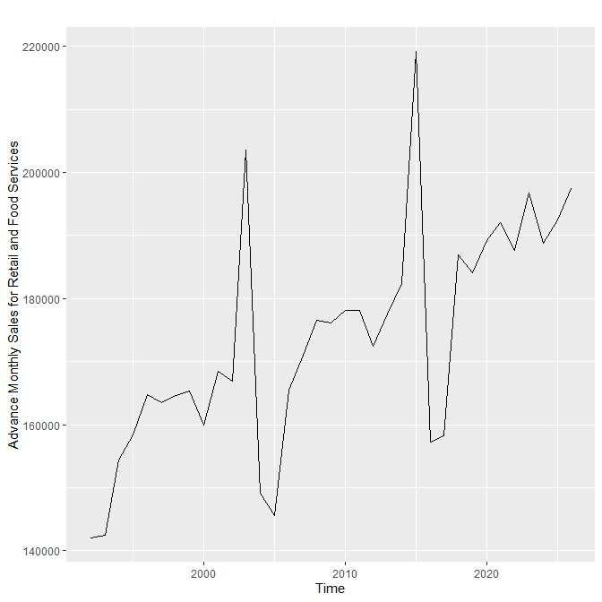
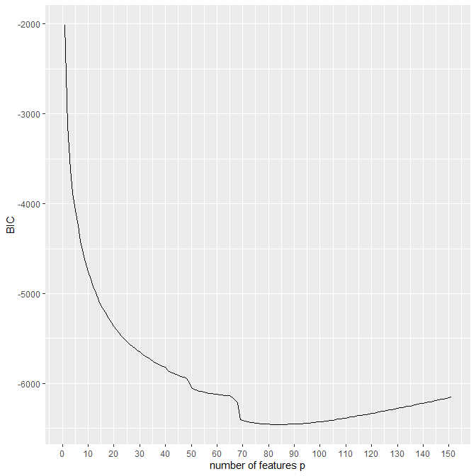

#+title: H W1

* DSC551 HW1

#+begin_src r

> setwd('c:/Users/jph6366/Desktop/SPATIOTEMPORAL/')
> dataretail <- read.csv("retail.csv")
> head(dataretail)
    Period   Value
1 Jan-1992 142,051
2 Feb-1992 142,498
3 Mar-1992 154,439
4 Apr-1992 158,430
5 May-1992 164,788
6 Jun-1992 163,417
> tail(dataretail)
      Period Value
415 Jul-2026  <NA>
416 Aug-2026  <NA>
417 Sep-2026  <NA>
418 Oct-2026  <NA>
419 Nov-2026  <NA>
420 Dec-2026  <NA>
> class(dataretail)
[1] "data.frame"
> class(dataretail$Value)
[1] "character"
> ourdata <- as.numeric(gsub(",","",dataretail$Value))
> head(ourdata)
[1] 142051 142498 154439 158430 164788 163417
> ts(ourdata, start=c(1992,1), end=c(2026,1))
Time Series:
Start = 1992
End = 2026
Frequency = 1
 [1] 142051 142498 154439 158430 164788 163417 164575 165387 159892 168529 166918 203616
[13] 149066 145607 165467 171075 176619 176095 178060 178176 172381 177545 182451 219162
[25] 157262 158247 186925 184025 189261 192034 187716 196791 188722 192462 197408
> autoplot(ts(ourdata, start=c(1992,1), end=c(2026,1)))
Error in autoplot(ts(ourdata, start = c(1992, 1), end = c(2026, 1))) :
  could not find function "autoplot"
> library(ggplot2)
> autoplot(ts(ourdata, start=c(1992,1), end=c(2026,1)))
Error in `autoplot()`:
! Objects of class <ts> are not supported by autoplot.
ℹ Have you loaded the required package?
Run `rlang::last_trace()` to see where the error occurred.
> library(fpp2)
── Attaching packages ────────────────────────────────────────────────────────── fpp2 2.5.1 ──
✔ forecast  9.0.1     ✔ expsmooth 2.3
✔ fma       2.5

> autoplot(ts(ourdata, start=c(1992,1), end=c(2026,1)), ylab="Advance Monthly Sales for Retail and Food Services")
#+end_src

  
** Observing the plot

- Looking at the plot we definitely see a cycle happening every decade
  - we can observe peaks/local max of sales is affected by the frequency
    - but there is a pattern or trend that is observed and repeated throughout the data
- There is a irregularities in the data that happen in the passing of 2010 and 2020 (when viewing with monthly aggegration )
  - we can observe spikes that create local maxixum and local minimum of sales
    - within aggregated seasonal data

#+begin_src R
> ames <- modeldata::ames
> regfit <- regsubsets(Sale_Price ~ ., data = ames, method = "forward", nvmax = 150)
Reordering variables and trying again:
Warning message:
In leaps.setup(x, y, wt = wt, nbest = nbest, nvmax = nvmax, force.in = force.in,  :
  6  linear dependencies found
> regfit.s <- summary(regfit)
> ggplot() +
  geom_line(aes(x = 1:151, y = regfit.s$bic)) +
  labs(y = "BIC", x = "number of features p") +
  scale_x_continuous(breaks = seq(0, 150, 10))
. + >
> best_idx <- which.min(regfit.s$bic)
> fs <- names(which(regfit.s$outmat[best_idx, ] == "*"))

> best_idx
[1] 85
> fullmodel<-model.matrix(Sale_Price ~ ., data = ames)
> P<-as.data.frame(fullmodel)

> D<-cbind(Sale_Price=ames$Sale_Price,P[,-1])

> fs <- names(which(regfit.s$outmat[best_idx, ] == "*"))

> selected_fs <- paste(fs, collapse = "+")

> model_bic <- lm(Sale_Price ~ MS_SubClassOne_Story_1945_and_Older+MS_SubClassTwo_Story_1945_and_Older+MS_SubClassDuplex_All_Styles_and_Ages+MS_SubClassOne_Story_PUD_1946_and_Newer+MS_SubClassTwo_Story_PUD_1946_and_Newer+MS_SubClassPUD_Multilevel_Split_Level_Foyer+Lot_Area+Land_ContourHLS+Land_ContourLvl+Lot_ConfigCulDSac+Land_SlopeSev+NeighborhoodEdwards+NeighborhoodSomerset+NeighborhoodNorthridge_Heights+NeighborhoodBrookside+NeighborhoodCrawford+NeighborhoodNorthridge+NeighborhoodStone_Brook+NeighborhoodBriardale+NeighborhoodNorthpark_Villa+NeighborhoodGreen_Hills+Condition_1Norm+Condition_1PosN+Condition_2PosA+Condition_2PosN+Overall_CondBelow_Average+Overall_CondAverage+Overall_CondAbove_Average+Overall_CondGood+Overall_CondVery_Good+Overall_CondExcellent+Year_Built+Year_Remod_Add+Roof_StyleHip+Roof_MatlCompShg+Roof_MatlMembran+Roof_MatlMetal+Roof_MatlRoll+`Roof_MatlTar&Grv`+Roof_MatlWdShake+Roof_MatlWdShngl+Exterior_1stBrkFace+Exterior_1stCemntBd+Exterior_1stHdBoard+Exterior_1stPlywood+Mas_Vnr_TypeNone+Mas_Vnr_TypeStone+Mas_Vnr_Area+FoundationCBlock+Bsmt_CondNo_Basement+Bsmt_ExposureGd+Bsmt_ExposureMn+Bsmt_ExposureNo+BsmtFin_Type_1GLQ+BsmtFin_Type_1Unf+BsmtFin_Type_2GLQ+BsmtFin_Type_2Unf+Bsmt_Unf_SF+Total_Bsmt_SF+Gr_Liv_Area+Bedroom_AbvGr+Kitchen_AbvGr+TotRms_AbvGrd+FunctionalTyp+Fireplaces+Garage_FinishRFn+Garage_FinishUnf+Garage_Cars+Garage_Area+Screen_Porch+Pool_Area+Pool_QCFair+Pool_QCGood+Pool_QCNo_Pool+Pool_QCTypical+Misc_FeatureGar2+Misc_FeatureNone+Misc_FeatureOthr+Misc_FeatureShed+Misc_FeatureTenC+Misc_Val+Sale_TypeNew+Sale_ConditionAdjLand+Sale_ConditionNormal+Longitude, data = D)
> BIC(model_bic)
[1] 68015.1
> AIC(model_bic)
[1] 67494.6
> summary(model_bic)

Call:
lm(formula = Sale_Price ~ MS_SubClassOne_Story_1945_and_Older +
    MS_SubClassTwo_Story_1945_and_Older + MS_SubClassDuplex_All_Styles_and_Ages +
    MS_SubClassOne_Story_PUD_1946_and_Newer + MS_SubClassTwo_Story_PUD_1946_and_Newer +
    MS_SubClassPUD_Multilevel_Split_Level_Foyer + Lot_Area +
    Land_ContourHLS + Land_ContourLvl + Lot_ConfigCulDSac + Land_SlopeSev +
    NeighborhoodEdwards + NeighborhoodSomerset + NeighborhoodNorthridge_Heights +
    NeighborhoodBrookside + NeighborhoodCrawford + NeighborhoodNorthridge +
    NeighborhoodStone_Brook + NeighborhoodBriardale + NeighborhoodNorthpark_Villa +
    NeighborhoodGreen_Hills + Condition_1Norm + Condition_1PosN +
    Condition_2PosA + Condition_2PosN + Overall_CondBelow_Average +
    Overall_CondAverage + Overall_CondAbove_Average + Overall_CondGood +
    Overall_CondVery_Good + Overall_CondExcellent + Year_Built +
    Year_Remod_Add + Roof_StyleHip + Roof_MatlCompShg + Roof_MatlMembran +
    Roof_MatlMetal + Roof_MatlRoll + `Roof_MatlTar&Grv` + Roof_MatlWdShake +
    Roof_MatlWdShngl + Exterior_1stBrkFace + Exterior_1stCemntBd +
    Exterior_1stHdBoard + Exterior_1stPlywood + Mas_Vnr_TypeNone +
    Mas_Vnr_TypeStone + Mas_Vnr_Area + FoundationCBlock + Bsmt_CondNo_Basement +
    Bsmt_ExposureGd + Bsmt_ExposureMn + Bsmt_ExposureNo + BsmtFin_Type_1GLQ +
    BsmtFin_Type_1Unf + BsmtFin_Type_2GLQ + BsmtFin_Type_2Unf +
    Bsmt_Unf_SF + Total_Bsmt_SF + Gr_Liv_Area + Bedroom_AbvGr +
    Kitchen_AbvGr + TotRms_AbvGrd + FunctionalTyp + Fireplaces +
    Garage_FinishRFn + Garage_FinishUnf + Garage_Cars + Garage_Area +
    Screen_Porch + Pool_Area + Pool_QCFair + Pool_QCGood + Pool_QCNo_Pool +
    Pool_QCTypical + Misc_FeatureGar2 + Misc_FeatureNone + Misc_FeatureOthr +
    Misc_FeatureShed + Misc_FeatureTenC + Misc_Val + Sale_TypeNew +
    Sale_ConditionAdjLand + Sale_ConditionNormal + Longitude,
    data = D)

Residuals:
    Min      1Q  Median      3Q     Max
-309366  -11726     366   11346  169309

Coefficients:
                                              Estimate Std. Error t value Pr(>|t|)
(Intercept)                                 -1.256e+07  2.093e+06  -6.002 2.20e-09 ***
MS_SubClassOne_Story_1945_and_Older          6.960e+03  2.485e+03   2.801 0.005131 **
MS_SubClassTwo_Story_1945_and_Older          9.630e+03  2.649e+03   3.635 0.000283 ***
MS_SubClassDuplex_All_Styles_and_Ages       -1.614e+04  3.960e+03  -4.076 4.70e-05 ***
MS_SubClassOne_Story_PUD_1946_and_Newer     -2.242e+04  2.272e+03  -9.866  < 2e-16 ***
MS_SubClassTwo_Story_PUD_1946_and_Newer     -3.044e+04  3.008e+03 -10.119  < 2e-16 ***
MS_SubClassPUD_Multilevel_Split_Level_Foyer -3.421e+04  6.397e+03  -5.348 9.60e-08 ***
Lot_Area                                     4.102e-01  7.613e-02   5.388 7.70e-08 ***
Land_ContourHLS                              1.758e+04  3.107e+03   5.657 1.69e-08 ***
Land_ContourLvl                              6.015e+03  2.019e+03   2.979 0.002913 **
Lot_ConfigCulDSac                            4.156e+03  1.954e+03   2.127 0.033488 *
Land_SlopeSev                               -2.532e+04  7.690e+03  -3.293 0.001005 **
NeighborhoodEdwards                         -6.354e+03  2.072e+03  -3.067 0.002181 **
NeighborhoodSomerset                         2.672e+04  2.254e+03  11.855  < 2e-16 ***
NeighborhoodNorthridge_Heights               4.820e+04  2.463e+03  19.570  < 2e-16 ***
NeighborhoodBrookside                        8.362e+03  2.530e+03   3.305 0.000962 ***
NeighborhoodCrawford                         1.517e+04  2.747e+03   5.523 3.64e-08 ***
NeighborhoodNorthridge                       3.523e+04  3.317e+03  10.622  < 2e-16 ***
NeighborhoodStone_Brook                      6.295e+04  3.862e+03  16.300  < 2e-16 ***
NeighborhoodBriardale                        2.342e+04  5.435e+03   4.309 1.69e-05 ***
NeighborhoodNorthpark_Villa                  3.137e+04  5.690e+03   5.513 3.85e-08 ***
NeighborhoodGreen_Hills                      1.202e+05  1.722e+04   6.978 3.71e-12 ***
Condition_1Norm                              8.958e+03  1.414e+03   6.336 2.72e-10 ***
Condition_1PosN                              1.624e+04  4.336e+03   3.745 0.000184 ***
Condition_2PosA                              9.590e+04  1.228e+04   7.811 7.92e-15 ***
Condition_2PosN                             -9.927e+04  1.294e+04  -7.671 2.33e-14 ***
Overall_CondBelow_Average                    1.294e+04  3.864e+03   3.349 0.000821 ***
Overall_CondAverage                          2.141e+04  3.215e+03   6.660 3.28e-11 ***
Overall_CondAbove_Average                    2.775e+04  3.264e+03   8.503  < 2e-16 ***
Overall_CondGood                             3.710e+04  3.395e+03  10.926  < 2e-16 ***
Overall_CondVery_Good                        4.039e+04  3.870e+03  10.436  < 2e-16 ***
Overall_CondExcellent                        5.508e+04  5.184e+03  10.626  < 2e-16 ***
Year_Built                                   4.950e+02  3.481e+01  14.220  < 2e-16 ***
Year_Remod_Add                               1.094e+02  3.536e+01   3.094 0.001992 **
Roof_StyleHip                                5.719e+03  1.285e+03   4.452 8.84e-06 ***
Roof_MatlCompShg                             6.685e+05  3.301e+04  20.250  < 2e-16 ***
Roof_MatlMembran                             7.147e+05  4.196e+04  17.033  < 2e-16 ***
Roof_MatlMetal                               6.992e+05  4.192e+04  16.678  < 2e-16 ***
Roof_MatlRoll                                6.665e+05  4.107e+04  16.227  < 2e-16 ***
`Roof_MatlTar&Grv`                           6.650e+05  3.319e+04  20.035  < 2e-16 ***
Roof_MatlWdShake                             6.585e+05  3.394e+04  19.404  < 2e-16 ***
Roof_MatlWdShngl                             7.416e+05  3.397e+04  21.831  < 2e-16 ***
Exterior_1stBrkFace                          1.545e+04  2.797e+03   5.523 3.63e-08 ***
Exterior_1stCemntBd                          8.285e+03  2.474e+03   3.348 0.000823 ***
Exterior_1stHdBoard                         -5.282e+03  1.416e+03  -3.730 0.000196 ***
Exterior_1stPlywood                         -7.136e+03  1.985e+03  -3.595 0.000330 ***
Mas_Vnr_TypeNone                             7.630e+03  1.465e+03   5.208 2.04e-07 ***
Mas_Vnr_TypeStone                            6.928e+03  1.910e+03   3.628 0.000290 ***
Mas_Vnr_Area                                 3.854e+01  4.048e+00   9.523  < 2e-16 ***
FoundationCBlock                            -2.398e+03  1.301e+03  -1.843 0.065364 .
Bsmt_CondNo_Basement                         1.919e+04  4.151e+03   4.622 3.98e-06 ***
Bsmt_ExposureGd                              1.632e+04  2.022e+03   8.069 1.04e-15 ***
Bsmt_ExposureMn                             -8.068e+03  2.008e+03  -4.018 6.01e-05 ***
Bsmt_ExposureNo                             -6.497e+03  1.415e+03  -4.590 4.62e-06 ***
BsmtFin_Type_1GLQ                            8.136e+03  1.480e+03   5.496 4.23e-08 ***
BsmtFin_Type_1Unf                            6.609e+03  1.637e+03   4.037 5.56e-05 ***
BsmtFin_Type_2GLQ                            1.437e+04  4.561e+03   3.151 0.001643 **
BsmtFin_Type_2Unf                            5.736e+03  1.589e+03   3.610 0.000311 ***
Bsmt_Unf_SF                                 -2.201e+01  1.829e+00 -12.031  < 2e-16 ***
Total_Bsmt_SF                                4.606e+01  2.115e+00  21.777  < 2e-16 ***
Gr_Liv_Area                                  6.104e+01  2.096e+00  29.123  < 2e-16 ***
Bedroom_AbvGr                               -5.697e+03  8.748e+02  -6.513 8.70e-11 ***
Kitchen_AbvGr                               -1.562e+04  3.530e+03  -4.424 1.00e-05 ***
TotRms_AbvGrd                                1.811e+03  6.195e+02   2.924 0.003484 **
FunctionalTyp                                1.596e+04  1.949e+03   8.191 3.87e-16 ***
Fireplaces                                   5.582e+03  8.733e+02   6.391 1.91e-10 ***
Garage_FinishRFn                            -7.783e+03  1.252e+03  -6.214 5.92e-10 ***
Garage_FinishUnf                            -3.963e+03  1.345e+03  -2.947 0.003234 **
Garage_Cars                                  3.516e+03  1.448e+03   2.429 0.015204 *
Garage_Area                                  1.814e+01  5.009e+00   3.622 0.000298 ***
Screen_Porch                                 4.114e+01  8.319e+00   4.946 8.02e-07 ***
Pool_Area                                    1.780e+01  5.919e+01   0.301 0.763687
Pool_QCFair                                 -8.308e+04  3.209e+04  -2.589 0.009679 **
Pool_QCGood                                 -7.913e+04  2.773e+04  -2.854 0.004347 **
Pool_QCNo_Pool                              -9.473e+04  2.452e+04  -3.864 0.000114 ***
Pool_QCTypical                              -9.696e+04  1.963e+04  -4.940 8.28e-07 ***
Misc_FeatureGar2                             5.681e+05  3.177e+04  17.882  < 2e-16 ***
Misc_FeatureNone                             5.722e+05  4.071e+04  14.055  < 2e-16 ***
Misc_FeatureOthr                             5.932e+05  3.832e+04  15.479  < 2e-16 ***
Misc_FeatureShed                             5.724e+05  3.973e+04  14.409  < 2e-16 ***
Misc_FeatureTenC                             5.282e+05  5.148e+04  10.260  < 2e-16 ***
Misc_Val                                     1.018e+00  1.847e+00   0.551 0.581567
Sale_TypeNew                                 2.225e+04  2.459e+03   9.049  < 2e-16 ***
Sale_ConditionAdjLand                        2.175e+04  7.402e+03   2.939 0.003321 **
Sale_ConditionNormal                         7.251e+03  1.604e+03   4.521 6.42e-06 ***
Longitude                                   -1.088e+05  2.259e+04  -4.819 1.52e-06 ***
---
Signif. codes:  0 '***' 0.001 '**' 0.01 '*' 0.05 '.' 0.1 ' ' 1

Residual standard error: 23960 on 2844 degrees of freedom
Multiple R-squared:  0.9127, Adjusted R-squared:   0.91
F-statistic: 349.6 on 85 and 2844 DF,  p-value: < 2.2e-16

> best_cp_f_idx <- which.min(regfit.s$cp)
> cat("Forward Cp optimal size:", best_cp_f_idx, "\n")
Forward Cp optimal size: 135
#+end_src

** Comparing model fit using AIC and BIC
- smaller BIC means better model
  - the forward selection indicates the model becomes better starting around 85
    - compared to the backwards selection at 82
      - thus affecting the AIC and BIC values respectively
        - BIC penalizes complexity ($log(n)$), the backward method found a slightly more "parsimonious" (simpler) model that likely has a lower (better) BIC score than the forward model.
- $C_p$ acts similarly to AIC; it focuses on minimizing predictive bias. For a dataset as large as Ames, $C_p$ will almost always suggest a more complex model than BIC.
